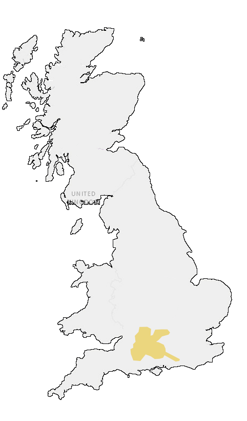
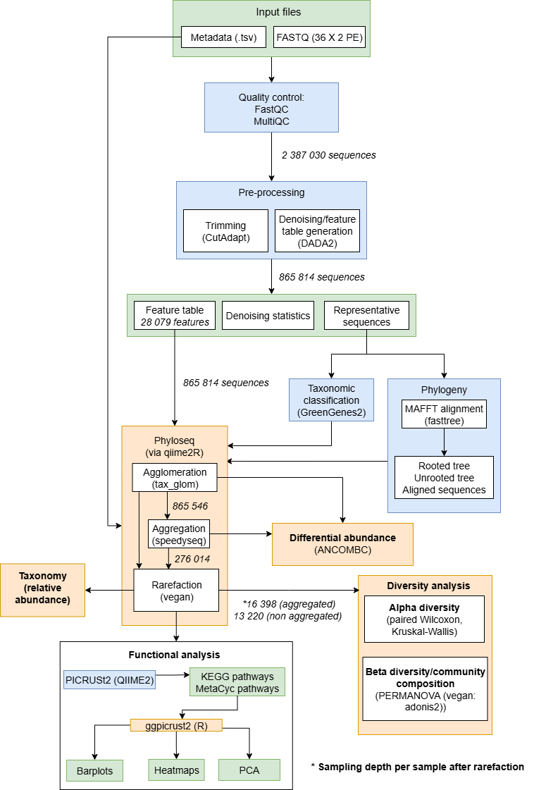
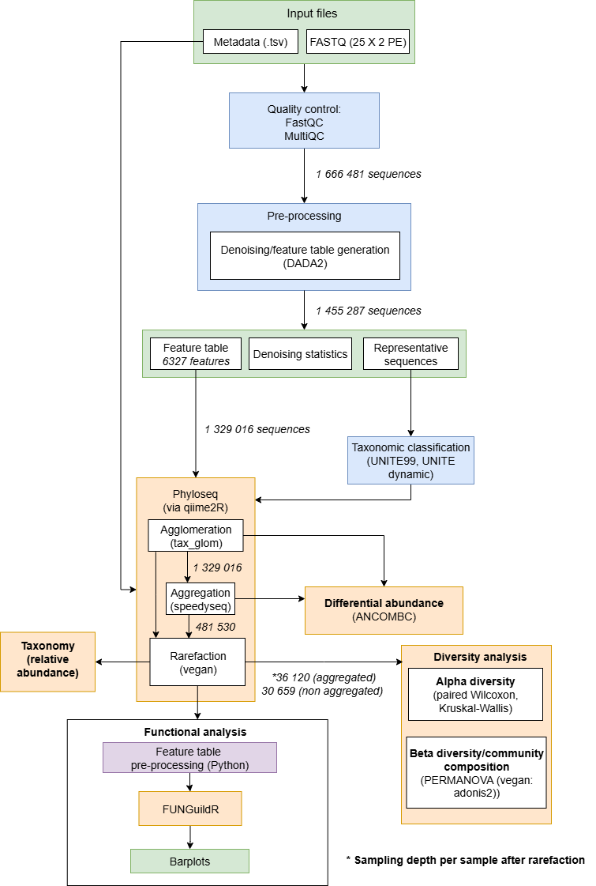

```{r title-centre, echo=FALSE, results='asis'}
cat('
<style>
h1.title {
  text-align: center;
  font-family: "Verdana
}
iframe {
  max-width: 100%;
  width: 100%;
  min-width: 0;
  border: none;
}

</style>
')
```

```{r custom-header, echo=FALSE, results='asis'}
cat('


<style>

body {
  font-size: 14px;
  line-height: 1.6;
  font-family: "Verdana"
}


h1, h2, h3, h4, h5, h6 {
  font-weight: bold;
}

h1 {
  font-size: 32px;
}

h2 {
  font-size: 26px;
}

h3 {
  font-size: 22px;
}

h4 {
  font-size: 20px;
}

h5 {
  font-size: 18px;
}

h6 {
  font-size: 16px;
}

p {
  font-size: 14px;
  font-family: "Verdana"
}
ul, ol, li {
  font-size: 14px;
}
summary {
  font-size: 15px;
}

body, .main-container {
  max-width: 95%;
  margin: 0 auto;
  font-size: 1.05rem;
}

.list-group-item.active {
  background-color: #000;
}

.header-bar {
  position: fixed;
  top: 0;
  left: 0;
  width: 100%;
  background-color: black;
  color: white; 
  display: flex;
  align-items: center;
  padding: 10px 20px;
  z-index: 9999;
  box-shadow: 0 2px 4px rgba(0,0,0,0.1);
  font-size: 26px;
  font-weight: bold;
}


.header-bar img {
  height: 45px;
  margin-right: 15px;
}


.header-text {
  text-align: center;
  font-family: "Verdana"
}


body {
  padding-top: 70px;
}


@media (max-width: 768px) {
  .header-bar {
    font-size: 18px;
    padding: 8px 10px;
  }
  .header-bar img {
    height: 35px;
    margin-right: 10px;
  }
}
</style>

<div class="header-bar">
  
  
  <div class="header-text">Analysing microbial communities from RestREco project</div>
</div>
')
```


```{r setup, include=FALSE}
knitr::opts_chunk$set(plotly.use.cdn = TRUE)
knitr::opts_chunk$set(echo = TRUE)
```

## Abstract and setting the scene

Drought and other climate change-associated weather events could affect ecosystem services provided by soil microbial communities.
Around 40% of the UK's land cover is grassland, so it is important to understand how water stress affects microbial communities.
This may help ecologists to identify strategies for promoting grassland resilience. 
The purpose of this project was to analyse 16S and ITS amplicon sequences from control and sheltered soil samples, collected by <a href="https://restreco.com/" target="_blank">RestREco</a>, to determine how short-term water stress affects the diversity, taxonomy and functions of soil bacteria and fungi. 
We used a well-established pipeline involving bioinformatics tools QIIME2, DADA2, and PICRUSt2 (see workflow diagram below), alongside R packages phyloseq, vegan, ggpicrust2 and FUNGuildR. 

### Summary of results

1. Strong changes in bacterial diversity could be seen between sites under water stress although the overall effect was not significant 
2. Drought had a significant effect on bacterial community composition (beta diversity) for rarer taxa,
3. Drought-tolerant phyla increased in several sites under simulated drought conditions. 
4. Parasitic fungal phyla, Zoopagomycota, significantly increased in some sites under water stress. 
5. Bacterial pathways associated with energy production and drought defence were differentially abundant between sites under shelter, indicating a drought response. 

We also found that site differences masked the full impact of drought, but the above findings indicate there were measurable effects on our bacterial and fungal communities, although the response from fungi was much more muted

This page focuses on alpha and beta diversity and taxonomy.

For differential abundance results, visit: <a href="https://kerrycranfield.github.io/RestREcoDrought/restreco_diff_abund.html" target="_blank">https://kerrycranfield.github.io/RestREcoDrought/restreco_diff_abund.html</a>

For functional analysis, visit: <a href="https://kerrycranfield.github.io/RestREcoDrought/restreco_func.html" target="_blank">https://kerrycranfield.github.io/RestREcoDrought/restreco_func.html</a>


```{r dependencies, echo=FALSE, message=FALSE, warning=FALSE}
library(BiocManager)
#BiocManager::install("microbiome")

#install.packages("remotes")
#remotes::install_github("mikemc/speedyseq")

#BiocManager::install("ANCOMBC")

#devtools::install_github("vmikk/metagMisc")

library("ggplot2")
library(phyloseq)
library(qiime2R)
library("microbiome")
library(vegan)
library(dplyr)
library(RColorBrewer)
library(plotly)
library(DT)
library(htmlwidgets)
library(tidyr)
library(tibble)
library(kableExtra)
```

## About the RestREco project

**RestREco** (*Restoring Resilient Ecosystems*) is a NERC-funded research project that aims to identify ecological restoration practices that can build resilience in ecosystems, particularly woodlands and grasslands. The initiative brings together researchers from:

- **Cranfield University**  
- **University of Stirling**
- **UK Centre for Ecology & Hydrology**  
- **The National Trust**  
- **Forest Research**

RestREco studies a network of 133 ecological restoration sites across England and Scotland. The project splits its work into seven work packages, each focusing on different factors and relating them to ecosystem characteristics that arise from component interactions. It aims to identify key drivers of ecosystem development, including:

- **Time since restoration began**  
- **Initial ecological conditions**  
- **Proximity to existing woodland and grassland**

The goal is to understand how these factors influence ecosystem complexity, function, and **resilience** to future pressures (RestREco, 2024).

</br>

## About this study

This study used targeted amplicon sequences (16S, ITS), retrieved from soil samples, to determine how **drought** affects soil microbial communities, specifically bacteria and fungi, in UK grasslands.

This study specifically focuses on:

- **Alpha and beta diversity**  
- **Taxonomic composition**  
- **Functional diversity**

We focused on the following four hypotheses. That **drought**:

- **Has a negative effect on the alpha diversity of bacterial and fungal communities**
- **Affects community composition (beta diversity)**
- **Induces changes in the taxonomic profiles of microbial communities**
- **Affects the abundances of bacterial pathways and fungal guild composition**

</br>

## Sample design and metadata

A total of 36 soil samples were collected across six sites in England for each marker (6 per site: 3 control, 3 shelter).

After sieving and extracting DNA, the V4-V5 region of the bacterial 16S gene and the ITS1-1F region of the fungal ITS gene was sequenced by Novogene.

Some fungal samples failed the initial quality control during the sequencing process, resulting in the removal of one site from the analysis (for fungi only), while other sites where one or two samples failed quality checks, were kept in (also for fungi).

```{r metadata-table, echo=FALSE}

sample_table <- data.frame (
  Metric = c(
    "Microbial group",
    "Region sampled",
    "Number of sites",
    "Samples per site",
    "Total samples removed",
    "Total samples",
    "Total samples per treatment",
    "Average reads per sample"
  ),
  `16S` = c(
    "Bacteria",
    "England",
    "6",
    "6",
    "0",
    "36",
    "18",
    "~66 000"
  ),
  `ITS` = c(
    "Fungi",
    "England",
    "5",
    "6",
    "3",
    "27",
    "13 (for most sites)",
    "~61 000"
  ),
  check.names = FALSE
)

sampling_table <- kable(sample_table, format="html", escape = FALSE, align="lcc", caption="Sample overview") %>%
  kable_styling(font_size = 12, bootstrap_options = c("condensed", "responsive"), full_width = FALSE, position="center") %>% 
  column_spec(1, bold=TRUE) %>% 
  row_spec(0, color="white", background = "black")

```

```{r map, echo=FALSE, message=FALSE, warning=FALSE}

htmltools::HTML('
<div style="display: flex; justify-content: center; align-items: flex-start; gap: 40px;">

  <div style="flex: 1; text-align: center;">
    
    <p style="font-weight: bold;">Sample Zone - Based on GPS coordinates</p>
  </div>

  <div style="flex: 1;text-align: center;">
    ', sampling_table, '
    <p style="font-weight: bold;">Sampling Summary</p>
  </div>

</div></br></br>
')

```

## Summary of methodology


<div style="display:flex; justify-content:center; gap:40px; margin-bottom: 1em">
  <div style="text-align: center">
  <a href="images/16Sworkflowdrawio.png" target="_blank"></a>

  </br><p style="font-weight: bold;">Workflow (16S)</p>
  </div>
  <div style="text-align: center">
  <a href="images/ITSworkflow.png" target="_blank"></a>

  </br><p style="font-weight: bold;">Workflow (ITS)</p>
  </div>
</div>


### High performance computing steps

Before diversity, taxonomy and functional analysis could take place, the initial analysis of the DNA sequences were performed using Cranfield University's high performance computing platform, Crescent2.

For all the scripts from the high performance computing/QIIME2 steps visit the project's GitHub page at [GitHub - RestREco Drought](https://github.com/kerrycranfield/RestREcoDrought)

These stages included quality control, trimming, denoising (merging paired reads, chimera removal and generating feature tables)


## Analysing soil moisture between control and shelter {.tabset}

To make sure the rain shelters put in place for the experiment actually led to lower soil moisture when compared to the control, we carried out a paired Wilcoxon signed-rank test to check differences were significant.

Here, we found soil in the shelter plots was significantly drier than in the control plots.

The differences in individual sites varied, with some sites showing a much larger difference than others

Across all samples, median soil moisture content was 39.8% for control and 6% for shelter with soil moisture percentages ranging from 17.6% to 48.5% (control) and 1.5% to 34.8% (shelter) 


``` {r process_measures, echo=FALSE, message = FALSE, warning=FALSE}
soil_measures = read.csv("data/soil_measures.csv", header=TRUE, sep=",")

soil_measures <- soil_measures %>% replace(cbind(40:42, 3), "S3")

soil_measures.df <- soil_measures %>% dplyr::select(Field, Control.Shelter, Plot, Soil.Moisture....)

soil_measures.wide <- soil_measures.df %>% group_by(Field, Plot) %>% summarise(mean_value=mean(Soil.Moisture....)) 

soil_measures.toplot <- soil_measures.df %>% dplyr::select(Field, Plot, Control.Shelter)

soil_measures.toplot <- distinct(soil_measures.toplot)

soil_measures.toplot <- soil_measures.toplot %>% merge(soil_measures.wide, soil_measures.toplot, by.x = c("Field", "Plot"), by.y=c("Field", "Plot"))

colnames(soil_measures.toplot)[1] <- "Site"
colnames(soil_measures.toplot)[3] <- "Treatment"
colnames(soil_measures.toplot)[4] <- "soil_moisture_percent"

soil_measures.toplot$Site <- stringr::str_replace_all(soil_measures.toplot$Site, "19", "Harley_Farms")

soil_measures.toplot$Site <- stringr::str_replace_all(soil_measures.toplot$Site, "2", "Castle_Field_West_W")

soil_measures.toplot$Site <- stringr::str_replace_all(soil_measures.toplot$Site, "Castle_Field_West_W0", "Windmill_Farm")

soil_measures.toplot$Site <- stringr::str_replace_all(soil_measures.toplot$Site, "54", "Jemma_6")

soil_measures.toplot$Site <- stringr::str_replace_all(soil_measures.toplot$Site, "55", "Jemma_9")

soil_measures.toplot$Site <- stringr::str_replace_all(soil_measures.toplot$Site, "Holies", "Lardon_Chase")

# Split data frame at treatment level after converting to factor
soil_measures.toplot$Treatment <- as.factor(soil_measures.toplot$Treatment)

measures.split <- split.data.frame(soil_measures.toplot, soil_measures.toplot$Treatment)

```

``` {r wilcoxon_measures, echo=FALSE, message = FALSE, warning=FALSE}

wilcox.measures.test <- wilcox.test(measures.split$Control[["soil_moisture_percent"]], measures.split$Shelter[["soil_moisture_percent"]], paired=TRUE)

```

### Treatment - overall

``` {r measures_plot_overall, echo=FALSE, message = FALSE, warning = FALSE}

treat.measures.box <- ggplot(soil_measures.toplot, aes(x=Treatment, y=soil_moisture_percent, color=Treatment)) + geom_boxplot() + labs(y="Soil moisture (%)") + ggtitle("Soil moisture comparisons between control and shelter", subtitle=paste("Wilcoxon signed rank test p-value:", wilcox.measures.test$p.value)) + theme(plot.title = element_text(size=16), axis.text = element_text(size = 14), axis.title= element_text(size=14, face="bold"))

treat.measures.box

ggsave("images/moisture_treat_plot.png", plot = treat.measures.box)

df <- soil_measures.toplot %>% group_by(Treatment) %>% summarize (med=median(soil_moisture_percent))

```

### Treatment - site-by-site

``` {r measures_plot_bysite, echo=FALSE, message=FALSE, warning=FALSE}

soil_measures.avg <- soil_measures.toplot %>% group_by(Site, Treatment) %>% summarise(Mean_moisture=mean(soil_moisture_percent)) 

treat.measures.dot <- ggplot(soil_measures.avg, aes(Treatment, Mean_moisture, color = Site, group=Site)) + geom_point() + geom_line() + labs(y="Soil moisture (%)") + ggtitle("Soil moisture comparisons between control and shelter", subtitle=paste("Wilcoxon signed rank test p-value:", wilcox.measures.test$p.value)) + theme(plot.title = element_text(size=16), axis.text = element_text(size = 14), axis.title= element_text(size=14, face="bold")) + scale_color_hue(labels=c("Castle Field West", "Harley Farms", "Jemma 6", "Jemma 9", "Lardon Chase", "Windmill Farm"))

treat.measures.dot
ggsave(filename = "images/moisture_site_plot.png", plot = treat.measures.dot)

```

## Import, filter and check

The feature table, taxonomy table, tree and metadata were imported into phyloseq from QIIME2 using qiime2R. Sequences belonging to archaea and unassigned sequences were removed. 

Below, we show how the phyloseq object changes with each step during preprocessing. A summary table is displayed after rarefaction is applied.


### Bacteria - import and check ASVs

```{r create_bac_object, echo=FALSE, message = FALSE, warning=FALSE}

# Import source files
feature_table_qza <- "data/16S/s04_table.qza"
rooted_tree_qza <- "data/16S/b06_rooted_tree.qza"
taxonomy_qza <- "data/16S/s05_taxonomy.qza"
metadata_tsv <- "data/16S/metadata.txt"

# Read data into phyloseq object
bac_data.phy <- qza_to_phyloseq(
  features = feature_table_qza,
  tree = rooted_tree_qza,
  taxonomy = taxonomy_qza,
  metadata = metadata_tsv
)

# Clean-up
rm(feature_table_qza, rooted_tree_qza, taxonomy_qza, metadata_tsv)

bac_data.phy
summary_initial.bac <- microbiome::summarize_phyloseq(bac_data.phy)

```

### Fungi - import and check ASVs

```{r create_fun_object, echo=FALSE, message = FALSE, warning=FALSE}
fun_feature_table_qza <- "data/ITS/f06_table.qza"
fun_taxonomy_qza <- "data/ITS/s05_taxonomy_dyn.qza"
fun_metadata_tsv <- "data/ITS/metadata.txt"

fun_data.phy <- qza_to_phyloseq(
  features=fun_feature_table_qza,
  taxonomy = fun_taxonomy_qza,
  metadata = fun_metadata_tsv
)

# Clean-up
rm(fun_feature_table_qza, fun_taxonomy_qza, fun_metadata_tsv)
detach("package:qiime2R", unload=TRUE)

fun_data.phy
summary_initial.fun <- microbiome::summarize_phyloseq(fun_data.phy)

```

```{r filter_bac_data, echo=FALSE, message = FALSE, warning=FALSE}
table(as.data.frame(tax_table(bac_data.phy))$Kingdom)

# Remove archaea and unassigned taxa
Bac <- subset_taxa(bac_data.phy, Kingdom== "d__Bacteria")
Bac # No of OTUs dropped from 28,079 to 28,055
```

``` {r check_fungi, echo=FALSE, message = FALSE, warning=FALSE}

table(as.data.frame(tax_table(fun_data.phy))$Kingdom)

```

## Agglomeration

Both the bacterial and fungal feature tables were then agglomerated to genera level. Reads below this level were retained.


### Bacteria

``` {r agglom_bac, echo=FALSE, message = FALSE, warning=FALSE}

# Agglomerate to genera level
Bac_Gen <- tax_glom(Bac, taxrank = "Genus", NArm=FALSE) # Reduces to 1118 genera vs qiime2's 1,194
Bac_Gen

aglom_summ.bac <- microbiome::summarize_phyloseq(Bac_Gen)
# Min no reads: 13 220
# Max no reads: 32 660
# Sparsity ~ 66.68%

```
### Fungi

``` {r agglom_fungi, echo=FALSE, message = FALSE, warning=FALSE}

Fun_Gen <- tax_glom(fun_data.phy, taxrank = "Genus", NArm=FALSE) # Reduces to 711 taxa 
Fun_Gen

aglom_summ.fun <- microbiome::summarize_phyloseq(Fun_Gen)

```
## Aggregation

Feature tables were then aggregated to site level using speedyseq as phyloseq merge_samples combines abundances using sum. Median was felt to be more representative of sample distribution plus prevented outliers from skewing the data.
Read counts were again generated to check the aggregation step was performed correctly and metadata was checked to ensure no NAs were coerced into the data.

### Bacteria

``` {r preprocess_bac, echo=FALSE, message = FALSE, warning=FALSE}
# Using speedyseq for aggregating at site level - provides option to use median rather than sum
BacGenSites <- speedyseq::merge_samples2(Bac_Gen, group = "Group_by", fun_otu = median)
BacGenSites

summ_postagg.bac <- microbiome::summarize_phyloseq(BacGenSites)
# Sparsity ~71.7%

```
### Fungi

``` {r preprocess_fun, echo=FALSE, message = FALSE, warning=FALSE}
FunGenSites <- speedyseq::merge_samples2(Fun_Gen, group = "Group_by", fun_otu = median)
FunGenSites

# Round counts - median sites with two samples have decimal values so cannot be plotted on rarefaction curve
otu_table(FunGenSites) <- round(otu_table(FunGenSites))

summ_postagg.fun <- microbiome::summarize_phyloseq(FunGenSites)

```

## Rarefaction plot {.tabset}

Rarefaction curves were then generated to find sampling depths using the rarecurve function in the vegan package to generate a tibble friendly data frame to be passed to ggplot2 to generate attractive rarefaction plots. As non-aggregated data would be needed for later steps (ie. alpha diversity between sites), rarefaction curves were generated for this alongside those for aggregated data.

### Bacteria - aggregated

``` {r bac_rarefaction, echo=FALSE, message = FALSE, warning=FALSE, fig.dim=c(8, 5)}

# Extract the ASV table into a data frame - vegan requires this
otu_table_bac <- as.data.frame(t(otu_table(BacGenSites)))

# Run vegan rarefaction curve method
rare_curve_bac <- rarecurve(otu_table_bac, step=100, cex=0.5, col=rainbow(nrow(otu_table_bac)), label=TRUE, xlab= "Read depth", ylab="Number of ASVs", tidy = TRUE)

depth_bac <- min(microbiome::readcount(BacGenSites))

# Generate rarefaction plot using ggplot2
bac_curve <- ggplot(rare_curve_bac) + geom_line(aes(x=Sample, y=Species, color=Site)) + labs(title="Bacteria rarefaction curve", x="Read depth", y="Taxa") + geom_vline(xintercept = depth_bac, color = "red", linetype = "dashed")

ggplot2::ggsave("images/rareplot_bac.png", units="mm", height=200, width=400)
bac_curve

```

### Bacteria - unaggregated

``` {r bac_rarefact_nonagg, echo = FALSE, message = FALSE, warning=FALSE, fig.dim=c(8, 5)}

otu_table_bac.nonagg <- as.data.frame(t(otu_table(Bac_Gen)))

rare_curve_bac.nonagg <- rarecurve(otu_table_bac.nonagg, step=100, cex=0.5, col=rainbow(nrow(otu_table_bac.nonagg)), label=TRUE, xlab= "Read depth", ylab="Number of taxa", tidy = TRUE)

depth_bac.nonagg <- min(microbiome::readcount(Bac_Gen))

bac_curve.nonagg <- ggplot(rare_curve_bac.nonagg) + geom_line(aes(x=Sample, y=Species, color=Site)) + labs(title="Bacteria rarefaction curve for non-aggregated data", x="Read depth", y="Taxa") + geom_vline(xintercept = depth_bac.nonagg, color = "red", linetype = "dashed")

ggsave("images/rareplot_bac_nonagg.png", units="mm", height=200, width=400)
bac_curve.nonagg
```


### Fungi - aggregated

``` {r fun_rarefaction, echo=FALSE, message = FALSE, warning=FALSE, fig.dim=c(8, 5)}

otu_table_fun <- as.data.frame(t(otu_table(FunGenSites)))

rare_curve_fun <- rarecurve(otu_table_fun, step=100, cex=0.5, col=rainbow(nrow(otu_table_fun)), label=TRUE, xlab= "Read depth", ylab="Number of ASVs", tidy = TRUE)

depth_fun <- min(microbiome::readcount(FunGenSites))

fun_curve <- ggplot2::ggplot(rare_curve_fun) + ggplot2::geom_line(ggplot2::aes(x=Sample, y=Species, color=Site)) + ggplot2::labs(title="Fungi rarefaction curve", x="Read depth", y="Taxa") + ggplot2::geom_vline(xintercept = depth_fun, color = "red", linetype="dashed")

ggplot2::ggsave("images/rarecurve_fun.png", units="mm", height=200, width=400)

fun_curve
```

### Fungi - unaggregated

``` {r fun_rarefact_nonagg, echo=FALSE, message = FALSE, warning=FALSE, fig.dim=c(8, 5)}

otu_table_fun.nonagg <- as.data.frame(t(otu_table(Fun_Gen)))

rare_curve_fun.nonagg <- rarecurve(otu_table_fun.nonagg, step=100, cex=0.5, col=rainbow(nrow(otu_table_fun.nonagg)), label=TRUE, xlab= "Read depth", ylab="Number of taxa", tidy = TRUE)

depth_fun.nonagg <- min(microbiome::readcount(Fun_Gen))

fun_curve.nonagg <- ggplot(rare_curve_fun.nonagg) + geom_line(aes(x=Sample, y=Species, color=Site)) + labs(title="Fungal rarefaction curve for non-aggregated data", x="Read depth", y="Taxa") + geom_vline(xintercept = depth_fun.nonagg, color = "red", linetype = "dashed")

ggsave("images/rareplot_fun_nonagg.png", units="mm", height=200, width=400)
fun_curve.nonagg

```

## Apply rarefaction

Bacterial samples for aggregated counts were rarefied to a depth of 16 398 in order to retain all samples, while non-aggregated counts were rarefied to a depth of 13 320, using the rarefy_even_depth function with the replace parameter set to false.

For fungi, samples for aggregated counts were rarefied to a depth of 36 120 while non-aggregated counts were rarefied to 30 659.

### Bacteria

#### Aggregated

``` {r apply_rare_bac, echo = FALSE, message = FALSE, warning=FALSE}
BacGenSites.rarefied <- rarefy_even_depth(BacGenSites, sample.size = min(sample_sums(BacGenSites)), rngseed = 1984, replace=FALSE)
BacGenSites.rarefied

# Export feature table for use in other steps ie. PICRUSt2 in Python
BGS.df <- as.data.frame(otu_table(BacGenSites.rarefied))
colnames(BGS.df) <- stringr::str_replace(colnames(BGS.df), "Lardon Chase-Drought", "Lardon_Chase-Drought")

colnames(BGS.df) <- stringr::str_replace(colnames(BGS.df), "Lardon Chase-Control", "Lardon_Chase-Control")

BGS.df <- tibble::rownames_to_column(BGS.df, "OTU_ID")
write.table(BGS.df, file="data/feature_table.tsv", sep="\t", row.names=FALSE, quote=FALSE)

summ_rare_agg.bac <- microbiome::summarize_phyloseq(BacGenSites.rarefied)
```
#### Unaggregated

``` {r apply_rare_bac_nonagg, echo=FALSE, message = FALSE, warning=FALSE}
Bac_Gen.rarefied <- rarefy_even_depth(Bac_Gen, sample.size = min(sample_sums(Bac_Gen)), rngseed=1984, replace=FALSE)
Bac_Gen.rarefied

# Export feature table for use in other steps ie. PICRUSt2 in Python
BacGen.df <- as.data.frame(otu_table(Bac_Gen.rarefied))
colnames(BacGen.df) <- stringr::str_replace(colnames(BacGen.df), "Lardon Chase-Drought", "Lardon_Chase-Drought")

colnames(BacGen.df) <- stringr::str_replace(colnames(BacGen.df), "Lardon Chase-Control", "Lardon_Chase-Control")

BacGen.df <- tibble::rownames_to_column(BacGen.df, "OTU_ID")
write.table(BacGen.df, file="data/feature_table_nonagg.tsv", sep="\t", row.names=FALSE, quote=FALSE)

summ_rare_nonagg.bac <- microbiome::summarize_phyloseq(Bac_Gen.rarefied)

```

### Fungi

#### Aggregated

``` {r apply_rare_fun, echo=FALSE, message = FALSE, warning=FALSE}
FunGenSites.rarefied <- rarefy_even_depth(FunGenSites, sample.size = min(sample_sums(FunGenSites)), rngseed = 1984, replace = FALSE)
FunGenSites.rarefied

# Create dataframe from otu table and taxonomy for use in FunGuildR
FGS.feat <- as.data.frame(otu_table(FunGenSites.rarefied))
FGS.taxa <- as.data.frame(tax_table(FunGenSites.rarefied))
FGS.dt <- merge(FGS.feat, FGS.taxa, by="row.names", all=TRUE)

# Change first column name to sample
colnames(FGS.dt)[1] <- "OTU ID"

# Export data frame for processing in Python ahead of functional analysis
write.table(FGS.dt, file="data/merged_taxa.tsv", sep="\t", row.names=FALSE, quote=FALSE)

summ_rare_agg.fun <- microbiome::summarize_phyloseq(FunGenSites.rarefied)

```

#### Unaggregated

``` {r apply_rare_fun_nonagg, echo = FALSE, message = FALSE, warning=FALSE}

Fun_Gen.rarefied <- rarefy_even_depth(Fun_Gen, sample.size = min(sample_sums(Fun_Gen)), rngseed = 1984, replace = FALSE)
Fun_Gen.rarefied

summ_rare_nonagg.fun <- microbiome::summarize_phyloseq(Fun_Gen.rarefied)
```

## Preprocessing summary

Throughout preprocessing, microbiome's summarize_phyloseq function was used to generate statistics to see how the number of sequences changed throughout the process. These statistics included read counts and sparsity metrics (proportion of cells where count = 0).


```{r preprocess-summ-bac, echo=FALSE, message=FALSE, warning=FALSE}

summ_process_bac.table <- data.frame (
  Metric = c(
    "Min reads",
    "Max reads",
    "Total reads",
    "Average reads",
    "Sparsity",
    "No. singletons",
    "% singletons"
  ),
  `Start` = c(
    "13 222",
    "32 667",
    "865 814",
    "~24 050",
    "94.6%",
    "951",
    "3.39"
  ),
  `Agglomeration` = c(
    "13 220",
    "32 660",
    "865 546",
    "~24 043",
    "66.7%",
    "3",
    "0.27"
  ),
  `Aggregation` = c(
    "16 398",
    "28 026",
    "276 014",
    "~23 001",
    "69.2%",
    "484",
    "0.09"
  ),
  `Rarefaction` = c(
    "16 398",
    "16 398",
    "196 776",
    "16 398",
    "45.7%",
    "25",
    "3.99"
  ),
  check.names = FALSE
)

summary_table.bac <- kable(summ_process_bac.table, format="html", escape = FALSE, align="lcc", caption="Preprocessing summary - bacteria") %>%
  kable_styling(font_size = 12, bootstrap_options = c("condensed", "responsive"), full_width = FALSE, position="center") %>% 
  column_spec(1, bold=TRUE) %>% 
  row_spec(0, color="white", background = "black")

summary_table.bac

```

```{r preprocess-summ-fun, echo=FALSE, message=FALSE, warning=FALSE}

summ_process_fun.table <- data.frame (
  Metric = c(
    "Min reads",
    "Max reads",
    "Total reads",
    "Average reads",
    "Sparsity",
    "No. singletons",
    "% singletons"
  ),
  `Start` = c(
    "30 659",
    "78 553",
    "1 329 016",
    "~53 161",
    "91%",
    "0",
    "0"
  ),
  `Agglomeration` = c(
    "30 659",
    "78 553",
    "1 329 016",
    "~53 161",
    "91%",
    "0",
    "0"
  ),
  `Aggregation` = c(
    "36 120",
    "56 936",
    "481 530",
    "48 153",
    "70%",
    "203",
    "0.28"
  ),
  `Rarefaction` = c(
    "36 120",
    "36 120",
    "361 200",
    "36 120",
    "59%",
    "10",
    "1.96"
  ),
  check.names = FALSE
)

summary_table.fun <- kable(summ_process_fun.table, format="html", escape = FALSE, align="lcc", caption="Preprocessing summary - fungi") %>%
  kable_styling(font_size = 12, bootstrap_options = c("condensed", "responsive"), full_width = FALSE, position="center") %>% 
  column_spec(1, bold=TRUE) %>% 
  row_spec(0, color="white", background = "black")

summary_table.fun

```

## Taxonomy

Bar plots showing taxonomic composition at a phylum, class and family were generated for each variable being assessed: treatment, site and group (site-treatment). Functions for each type of bar plot were created before being used to generate the plots below.


``` {r taxa_plot_func, echo=FALSE, message = FALSE, warning=FALSE}

dep_var_phyla_barplot <- function(phyloseq.obj, dep_var, save_path) {

  # Merge samples by dependent variable being studied (categorical variable)
  psobj.merged <- merge_samples(phyloseq.obj, dep_var)
  
  # Renormalise counts after sample merging and transform to relative abundance
  psobj.merged <- transform_sample_counts(psobj.merged, function(x) x / sum(x))
  
  # Extract data from object so it can be plotted
  psobj.merged.df <- psmelt(psobj.merged)

  # Obtain counts by Phylum level
  taxa_level.df <- psobj.merged.df %>% group_by(Phylum) %>% summarise(Count = sum(Abundance))

  # Calculate the cut off for the desired taxa (in this case those that make up  1% of counts)
  cutoff<- 0.01 * sum(psobj.merged.df$Abundance)

  # Select low abundance taxa with counts below the cutoff
  lowAbundant <- taxa_level.df[taxa_level.df$Count <= cutoff,]$Phylum
  
  psobj.merged.df[psobj.merged.df$Phylum %in% lowAbundant,]$Phylum <- '<1%'
  
  # Create a high contrast palette
  n_colors <- length(unique(psobj.merged.df$Phylum))
  high_contrast_palette <- c(brewer.pal(min(9, n_colors), "Set1"), brewer.pal(max(0, n_colors - 9), "Dark2"))

  # Generate a bar plot using ggplot then pass to plotly to make it interactive
  barplot <- ggplot(psobj.merged.df, aes(x=Sample, y=Abundance, fill=Phylum, text=paste("Phylum:", Phylum, "<br>", dep_var, ":", Sample, "<br>Relative Abundance:", Abundance))) +
    geom_bar(stat="identity", position="stack") +
    scale_fill_manual(values = high_contrast_palette) +
    theme(axis.text.x = element_text(angle = 90)) + labs(title = paste("Taxa Abundance by", dep_var), x=dep_var, y="Relative abundance")
  
  barplot.plotly <- ggplotly(barplot, tooltip="text")
  barplot.plotly
  
  # Save the plot as an HTML file
  htmlwidgets::saveWidget(barplot.plotly, save_path)
  return(barplot.plotly)
  
}
```


``` {r taxa_class_plot_func, echo=FALSE, message = FALSE, warning=FALSE}

dep_var_class_barplot <- function(phyloseq.obj, dep_var, save_path) {

  # Merge samples by dependent variable being studied (categorical variable)
  psobj.merged <- merge_samples(phyloseq.obj, dep_var)
  
  # Renormalise counts after sample merging and transform to relative abundance
  psobj.merged <- transform_sample_counts(psobj.merged, function(x) x / sum(x))
  
  # Extract data from object so it can be plotted
  psobj.merged.df <- psmelt(psobj.merged)

  # Obtain counts by Phylum level
  taxa_level.df <- psobj.merged.df %>% group_by(Class) %>% summarise(Count = sum(Abundance))

  # Calculate the cut off for the desired taxa (in this case those that make up 1% of counts)
  cutoff<- 0.01 * sum(psobj.merged.df$Abundance)

  # Select low abundance taxa with counts below the cutoff
  lowAbundant <- taxa_level.df[taxa_level.df$Count <= cutoff,]$Class
  
  psobj.merged.df[psobj.merged.df$Class %in% lowAbundant,]$Class <- '<1%'
  
  n_colors <- length(unique(psobj.merged.df$Class))
  high_contrast_palette <- c(brewer.pal(min(9, n_colors), "Set1"), brewer.pal(max(0, n_colors - 9), "Dark2"))

  barplot <- ggplot(psobj.merged.df, aes(x=Sample, y=Abundance, fill=Class, text=paste("Class:", Class, "<br>", dep_var, ":", Sample, "<br>Relative Abundance:", Abundance))) +
    geom_bar(stat="identity", position="stack") +
    scale_fill_manual(values = high_contrast_palette) +
    theme(axis.text.x = element_text(angle = 90)) + labs(title = paste("Taxa Abundance by", dep_var), x=dep_var, y="Relative abundance")
  
  barplot.plotly <- ggplotly(barplot, tooltip="text")
  barplot.plotly
  
  # Save the plot as an HTML file
  htmlwidgets::saveWidget(barplot.plotly, save_path)
  return(barplot.plotly)
  
}

```

``` {r taxa_fam_plot_func, echo=FALSE, message = FALSE, warning=FALSE}
# Function for bar plot at family level (cutoff for grouping was set to 2% as a colour palette large enough to show all families present was not available at the time

dep_var_fam_barplot <- function(phyloseq.obj, dep_var, save_path) {

  # Merge samples by dependent variable being studied (categorical variable)
  psobj.merged <- merge_samples(phyloseq.obj, dep_var)
  
  # Renormalise counts after sample merging and transform to relative abundance
  psobj.merged <- transform_sample_counts(psobj.merged, function(x) x / sum(x))
  
  # Extract data from object so it can be plotted
  psobj.merged.df <- psmelt(psobj.merged)

  # Obtain counts by Phylum level
  taxa_level.df <- psobj.merged.df %>% group_by(Family) %>% summarise(Count = sum(Abundance))

  # Calculate the cut off for the desired taxa (in this case those that make up 1% of counts)
  cutoff<- 0.01 * sum(psobj.merged.df$Abundance)

  # Select low abundance taxa with counts below the cutoff
  lowAbundant <- taxa_level.df[taxa_level.df$Count <= cutoff,]$Family
  
  psobj.merged.df[psobj.merged.df$Family %in% lowAbundant,]$Family <- '<1%'
  
  n_colors <- length(unique(psobj.merged.df$Family))
  high_contrast_palette <- c(brewer.pal(min(9, n_colors), "Set1"), brewer.pal(max(0, n_colors - 9), "Dark2"))
  extended_palette <- colorRampPalette(high_contrast_palette)(n_colors)

  barplot <- ggplot(psobj.merged.df, aes(x=Sample, y=Abundance, fill=Family, text=paste("Family:", Family, "<br>", dep_var, ":", Sample, "<br>Relative Abundance:", Abundance))) +
    geom_bar(stat="identity", position="stack") +
    scale_fill_manual(values = extended_palette) +
    theme(axis.text.x = element_text(angle = 90)) + labs(title = paste("Taxa Abundance by", dep_var), x=dep_var, y="Relative abundance")
  
  barplot.plotly <- ggplotly(barplot, tooltip="text")
  barplot.plotly
  
  # Save the plot as an HTML file
  htmlwidgets::saveWidget(barplot.plotly, save_path)
  return(barplot.plotly)
  
}

```

### Bacteria

#### Phylum {.tabset}

No visible shifts in the most abundant bacterial phyla were observed in response to moisture deficits. Bacterial communities were dominated by Actinomycetota, Pseudomonadota, Acidobacteriota, Bacillota I and Chloroflexota.

These phyla are common to UK grassland soils so their presence here is to be expected.

However, the effects of moisture deficits on taxonomic composition were visible within individual sites. Shifts could be seen in the relative abundances of Actinomycetota, Pseudomonadota and Bacillota I, with the direction of change being site-dependent. 
Actinomycetota increased while Pseudomonadota showed a slight decrease in most sites following the soil moisture reduction. 
One site, Harley Farms, showed the opposite trend for both taxa. For Bacillota I, changes in relative abundance between sites could be seen.

Both Actinomycetota and Bacillota I are drought-tolerant so their changes in drought conditions could be indicative of these strategies.


```{r bac_process_phylum, echo=FALSE, warning=FALSE}

# Reagglomerate rarefied table to phylum level for plotting
BacGenSitesPhyla.rarefied <- tax_glom(BacGenSites.rarefied, taxrank="Phylum")

# Convert metadata categories to factors - avoid coercion to NAs during merging
sample_data(BacGenSitesPhyla.rarefied)$Treatment <- as.factor(sample_data(BacGenSitesPhyla.rarefied)$Treatment)
sample_data(BacGenSitesPhyla.rarefied)$Site <- as.factor(sample_data(BacGenSitesPhyla.rarefied)$Site)
sample_data(BacGenSitesPhyla.rarefied)$Field_no <- as.factor(sample_data(BacGenSitesPhyla.rarefied)$Field_no)
sample_data(BacGenSitesPhyla.rarefied)$Group_by <- as.factor(sample_data(BacGenSitesPhyla.rarefied)$Group_by)

```

##### Treatment

``` {r bac_phyla_treat_plot, echo=FALSE, message = FALSE, warning=FALSE}

BacPhylumTreat.plot <- dep_var_phyla_barplot(BacGenSitesPhyla.rarefied, dep_var = "Treatment", save_path="images/taxonomy_treat_phyla_bac.html")

BacPhylumTreat.plot

```

##### Site 

``` {r bac_phyla_site_plot, echo=FALSE, message = FALSE, warning=FALSE}

BacPhylumSite.plot <- dep_var_phyla_barplot(BacGenSitesPhyla.rarefied, dep_var = "Site", save_path = "images/taxonomy_site_phyla_bac.html")

BacPhylumSite.plot

```

##### Site-treatment


``` {r bac_phyla_group_plot, echo=FALSE, message=FALSE, warning=FALSE}

BacPhylumGroup.plot <- dep_var_phyla_barplot(BacGenSitesPhyla.rarefied, dep_var="Group_by", save_path = "images/taxonomy_group_phyla_bac.html")

BacPhylumGroup.plot

```

#### Class {.tabset}

As at phylum level, no visible changes in taxonomic composition could be seen between treatments overall.

On a site level, no large differences in taxonomic composition could be seen. Bacilli-A (orange) appeared to vary between sites with the biggest difference between Jemma 6 and Lardon Chase.

Between treatments on each site, differences were subtle. Harley Farms showed some substantial differences between treatments for Bacilli-A (increased in drought) while Lardon Chase saw a decrease in Alphaproteobacteria in drought. 


``` {r bac_plots_class, echo=FALSE, warning=FALSE}

# Reagglomerate rarefied table to class level for plotting
BacGenSitesClass.rarefied <- tax_glom(BacGenSites.rarefied, taxrank="Class")

# Convert metadata categories to factors - avoid coercion to NAs during merging
sample_data(BacGenSitesClass.rarefied)$Treatment <- as.factor(sample_data(BacGenSitesClass.rarefied)$Treatment)
sample_data(BacGenSitesClass.rarefied)$Site <- as.factor(sample_data(BacGenSitesClass.rarefied)$Site)
sample_data(BacGenSitesClass.rarefied)$Field_no <- as.factor(sample_data(BacGenSitesClass.rarefied)$Field_no)
sample_data(BacGenSitesClass.rarefied)$Group_by <- as.factor(sample_data(BacGenSitesClass.rarefied)$Group_by)

```

##### Treatment

```{r bac_class_treat_plot, echo=FALSE, message=FALSE, warning=FALSE}

BacClassTreat.plot <- dep_var_class_barplot(BacGenSitesClass.rarefied, dep_var = "Treatment", save_path="images/taxonomy_treat_class_bac.html")
BacClassTreat.plot

```
##### Site

``` {r bac_class_site_plot, echo=FALSE, message=FALSE, warning=FALSE}

BacClassSite.plot <- dep_var_class_barplot(BacGenSitesClass.rarefied, dep_var = "Site", save_path="images/taxonomy_site_class_bac.html")
BacClassSite.plot

```

##### Site-treatment

```{r r bac_class_group_plot, echo=FALSE, message=FALSE, warning=FALSE}

BacClassGroup.plot <- dep_var_class_barplot(BacGenSitesClass.rarefied, dep_var = "Group_by", save_path="images/taxonomy_group_class_bac.html")
BacClassGroup.plot

```

#### Family {.tabset}

Differences in taxonomic composition between control and drought were not observed. At a site-treatment level, subtle shifts could be seen in some families (DSM-18226_301387, Geminicoccaceae for example)


```{r bac_plots_fam, echo=FALSE, message = FALSE, warning=FALSE}

# Reagglomerate rarefied table to family level for plotting
BacGenSitesFam.rarefied <- tax_glom(BacGenSites.rarefied, taxrank="Family")

# Convert metadata categories to factors - avoid coercion to NAs during merging
sample_data(BacGenSitesFam.rarefied)$Treatment <- as.factor(sample_data(BacGenSitesFam.rarefied)$Treatment)
sample_data(BacGenSitesFam.rarefied)$Site <- as.factor(sample_data(BacGenSitesFam.rarefied)$Site)
sample_data(BacGenSitesFam.rarefied)$Field_no <- as.factor(sample_data(BacGenSitesFam.rarefied)$Field_no)
sample_data(BacGenSitesFam.rarefied)$Group_by <- as.factor(sample_data(BacGenSitesFam.rarefied)$Group_by)

```

##### Treatment

```{r bac_fam_treat_plot, echo=FALSE, message=FALSE, warning=FALSE}

BacFamTreat.plot <- dep_var_fam_barplot(BacGenSitesFam.rarefied, dep_var = "Treatment", save_path="images/taxonomy_treat_family_bac.html")
BacFamTreat.plot

```

##### Site

``` {r bac_fam_site_plot, echo=FALSE, message=FALSE, warning=FALSE}

BacFamSite.plot <- dep_var_fam_barplot(BacGenSitesFam.rarefied, dep_var = "Site", save_path="images/taxonomy_site_family_bac.html")
BacFamSite.plot

```

##### Site-treatment

``` {r bac_fam_group_plot, echo=FALSE, message=FALSE, warning=FALSE}

BacFamGroup.plot <- dep_var_fam_barplot(BacGenSitesFam.rarefied, dep_var = "Group_by", save_path="images/taxonomy_group_family_bac.html")
BacFamGroup.plot

```

### Fungi

#### Phylum {.tabset}

Fungal community taxonomy also showed no major shifts in the abundance of the major phyla in response to water stress. 
Ascomycota, Mortierellomycota and Basidiomycota dominated communities. Zoopagomycota increased slightly in drought. Around 10% of fungal ASVs could not be identified to phyla level.

On individual sites, treatment-associated shifts in fungal community composition could be observed in Ascomycota and Mortierellomycota with direction of change site-dependent.

Ascomycota abundances increased in shelter samples in three out of the five sites while Mortierellomycota showed the opposite trend. 

Interestingly, the sites where Ascomycota decreased under water stress were the same sites where Mortierellomycota increased. An increase in the abundance of Zoopagomycota was also of note on Windmill Farm


``` {r fun_plots_phylum, echo=FALSE, warning=FALSE}

# Reagglomerate rarefied table to phylum level for taxonomy plot generation
FunGenSitesPhyla.rarefied <- tax_glom(FunGenSites.rarefied, taxrank = "Phylum")

sample_data(FunGenSitesPhyla.rarefied)$Treatment <- as.factor(sample_data(FunGenSitesPhyla.rarefied)$Treatment)
sample_data(FunGenSitesPhyla.rarefied)$Site <- as.factor(sample_data(FunGenSitesPhyla.rarefied)$Site)
sample_data(FunGenSitesPhyla.rarefied)$Field_no <- as.factor(sample_data(FunGenSitesPhyla.rarefied)$Field_no)
sample_data(FunGenSitesPhyla.rarefied)$Group_by <- as.factor(sample_data(FunGenSitesPhyla.rarefied)$Group_by)

```

##### Treatment

``` {r fun_phyla_treat_plot, echo=FALSE, message=FALSE, warning=FALSE}

FunPhylumTreat.plot <- dep_var_phyla_barplot(FunGenSitesPhyla.rarefied, dep_var="Treatment", save_path="images/taxonomy_treat_phyla_fun.html")
FunPhylumTreat.plot

```

##### Site

```{r fun_phyla_site_plot, echo=FALSE, message=FALSE, warning=FALSE}

FunPhylumSite.plot <- dep_var_phyla_barplot(FunGenSitesPhyla.rarefied, dep_var="Site", save_path="images/taxonomy_site_phyla_fun.html")
FunPhylumSite.plot

```

##### Site-treatment

``` {r fun_phyla_group_plot, echo=FALSE, message=FALSE, warning=FALSE}

FunPhylumGroup.plot <- dep_var_phyla_barplot(FunGenSitesPhyla.rarefied, dep_var="Group_by", save_path="images/taxonomy_group_phyla_fun.html")
FunPhylumGroup.plot

```
#### Class {.tabset}

At a class level, no major taxonomic shifts could be seen in relation to drought. Sordariomycetes and Mortierellomycetes were the dominant classes here.

On some sites, changes in the abundances of these families could be seen between control and drought. The direction of change varied between sites, perhaps indicating an interaction between water stress and site conditions

``` {r fun_plots_class, echo=FALSE, warning=FALSE}

# Reagglomerate rarefied table to class level for plotting
FunGenSitesClass.rarefied <- tax_glom(FunGenSites.rarefied, taxrank="Class")

# Convert metadata categories to factors - avoid coercion to NAs during merging
sample_data(FunGenSitesClass.rarefied)$Treatment <- as.factor(sample_data(FunGenSitesClass.rarefied)$Treatment)
sample_data(FunGenSitesClass.rarefied)$Site <- as.factor(sample_data(FunGenSitesClass.rarefied)$Site)
sample_data(FunGenSitesClass.rarefied)$Field_no <- as.factor(sample_data(FunGenSitesClass.rarefied)$Field_no)
sample_data(FunGenSitesClass.rarefied)$Group_by <- as.factor(sample_data(FunGenSitesClass.rarefied)$Group_by)

```

##### Treatment

```{r fun_class_treat_plot, echo=FALSE, message=FALSE, warning=FALSE}

FunClassTreat.plot <- dep_var_class_barplot(FunGenSitesClass.rarefied, dep_var = "Treatment", save_path="images/taxonomy_treat_class_fun.html")
FunClassTreat.plot

```

##### Site

``` {r fun_class_site_plot, echo=FALSE, message=FALSE, warning=FALSE}

FunClassSite.plot <- dep_var_class_barplot(FunGenSitesClass.rarefied, dep_var = "Site", save_path="images/taxonomy_site_class_fun.html")
FunClassSite.plot

```

##### Site-treatment

``` {r fun_class_group_plot, echo=FALSE, message=FALSE, warning=FALSE}

FunClassGroup.plot <- dep_var_class_barplot(FunGenSitesClass.rarefied, dep_var = "Group_by", save_path="images/taxonomy_group_class_fun.html")
FunClassGroup.plot

```

#### Family {.tabset}

At a family level the dominant fungal families were Mortierellaceae, Bionectriaceae and Plectosphaerellaceae. Mortierellaceae showed different directions of change in different sites.


``` {r fun_plots_fam, echo=FALSE, warning=FALSE}

# Reagglomerate rarefied table to family level for plotting
FunGenSitesFam.rarefied <- tax_glom(FunGenSites.rarefied, taxrank = "Family")

sample_data(FunGenSitesFam.rarefied)$Treatment <- as.factor(sample_data(FunGenSitesFam.rarefied)$Treatment)
sample_data(FunGenSitesFam.rarefied)$Site <- as.factor(sample_data(FunGenSitesFam.rarefied)$Site)
sample_data(FunGenSitesFam.rarefied)$Field_no <- as.factor(sample_data(FunGenSitesFam.rarefied)$Field_no)
sample_data(FunGenSitesFam.rarefied)$Group_by <- as.factor(sample_data(FunGenSitesFam.rarefied)$Group_by)

```

##### Treatment

```{r fun_fam_treat_plot, echo=FALSE, message=FALSE, warning=FALSE}

FunFamTreat.plot <- dep_var_fam_barplot(FunGenSitesFam.rarefied, dep_var = "Treatment", save_path="images/taxonomy_treat_family_fun.html")
FunFamTreat.plot

```

##### Site

``` {r fun_fam_site_plot, echo=FALSE, message=FALSE, warning=FALSE}
FunFamSite.plot <- dep_var_fam_barplot(FunGenSitesFam.rarefied, dep_var = "Site", save_path="images/taxonomy_site_family_fun.html")
FunFamSite.plot

```

##### Site-treatment

```{r fun_fam_group_plot, echo=FALSE, message=FALSE, warning=FALSE}

FunFamGroup.plot <- dep_var_fam_barplot(FunGenSitesFam.rarefied, dep_var = "Group_by", save_path="images/taxonomy_group_family_fun.html")
FunFamGroup.plot

```

## Alpha diversity

Alpha diversity calculations were run for both bacteria and fungi to determine if there were differences in diversity between sites and treatments.

The Chao1, Shannon and Simpson metrics were used to measure richness and evenness. Chao1 is weighted towards doubletons and singletons while the other metrics place a different emphasis on richness and evenness.

We also tested for statistical significance using paired Wilcoxon signed-rank test and Kruskal Wallis test.


``` {r alpha_div_func, echo=FALSE}
alpha_diversity.plot <- function(alpha_richness, phyloseq_obj, dep_var, colour_var) {
  
  if (nlevels(sample_data(phyloseq_obj)[[dep_var]]) == 2) {
    # Apply Wilcoxon test 
    chao1_res <- wilcox.test(alpha_richness$Chao1~sample_data(phyloseq_obj)[[dep_var]])
    chao1.p_value <- chao1_res$p.value
    shannon_res <- wilcox.test(alpha_richness$Shannon~
                               sample_data(phyloseq_obj)[[dep_var]])
    shannon.p_value <- shannon_res$p.value
    simpson_res <- wilcox.test(alpha_richness$Simpson~
                               sample_data(phyloseq_obj)[[dep_var]], paired = TRUE)
    simpson.p_value <- simpson_res$p.value
    } else if (nlevels(sample_data(phyloseq_obj)[[dep_var]]) > 2) {
    chao1_res <- kruskal.test(alpha_richness$Chao1~
                             sample_data(phyloseq_obj)[[dep_var]])
    chao1.p_value <- chao1_res$p.value
    shannon_res <- kruskal.test(alpha_richness$Shannon~
                               sample_data(phyloseq_obj)[[dep_var]])
    shannon.p_value <- shannon_res$p.value
    simpson_res <- kruskal.test(alpha_richness$Simpson~
                               sample_data(phyloseq_obj)[[dep_var]])
    simpson.p_value <- simpson_res$p.value
    }
  richplot <- plot_richness(phyloseq_obj, measures=c("Chao1", "Shannon", "Simpson"), color=colour_var, x=dep_var) + ggtitle(paste("Alpha diversity vs", dep_var), subtitle=paste(chao1_res$method, ":", "\nChao1 p-value:", chao1.p_value, "\nShannon p-value:", shannon.p_value, "\nSimpson p-value:", simpson.p_value)) + theme(axis.text = element_text(size = 14))
  
  res_list <- list(chao1_res, shannon_res, simpson_res, richplot)
  return(res_list)
}

```

### Bacteria {.tabset}

``` {r alpha_div_bac, echo=FALSE, message = FALSE, warning = FALSE}

# Process data to ensure treatment, site and group are factors for aggregated and non-aggregated data
sample_data(BacGenSites.rarefied)$Treatment <- as.factor(sample_data(BacGenSites.rarefied)$Treatment)
sample_data(BacGenSites.rarefied)$Site <- as.factor(sample_data(BacGenSites.rarefied)$Site)
sample_data(BacGenSites.rarefied)$Field_no <- as.factor(sample_data(BacGenSites.rarefied)$Field_no)
sample_data(BacGenSites.rarefied)$Group_by <- as.factor(sample_data(BacGenSites.rarefied)$Group_by)

sample_data(Bac_Gen.rarefied)$Treatment <- as.factor(sample_data(Bac_Gen.rarefied)$Treatment)
sample_data(Bac_Gen.rarefied)$Site <- as.factor(sample_data(Bac_Gen.rarefied)$Site)
sample_data(Bac_Gen.rarefied)$Field_no <- as.factor(sample_data(Bac_Gen.rarefied)$Field_no)
sample_data(Bac_Gen.rarefied)$Group_by <- as.factor(sample_data(Bac_Gen.rarefied)$Group_by)

# Run estimate_richness on aggregated data
bac_alpha_richness <- estimate_richness(BacGenSites.rarefied, measures = c("Chao1", "Shannon", "Simpson"))
bac_alpha_rich.df <- as.data.frame(bac_alpha_richness)
bac_alpha_rich.df <- rownames_to_column(bac_alpha_rich.df, var="Site")

bac_alpha_rich.DT <- datatable(
  bac_alpha_rich.df,
  colnames=c("Site", "Chao1", "SE Chao1", "Shannon", "Simpson"),
  caption = htmltools::tags$caption( style = 'caption-side: top; text-align: center; color:black;  font-size: 150% ;','Alpha diversity metrics for aggregated data'),
  options = list(
    pageLength = 15,
    scrollX = TRUE,
    autoWidth = FALSE,
    dom = 'tip',
    class = 'stripe hover row-border order-column',
    initComplete = JS(
      "function(settings, json) {",
      "$(this.api().table().header()).css({'background-color': '#000', 'color': '#fff', 'font-weight': 'bold', 'text-align': 'center'});",
      "}")
  ),
  class = "display nowrap compact",
  rownames = FALSE
) %>% 
  formatStyle(
    columns = names(bac_alpha_rich.df),
    `text-align` = 'center'
    )

# Run estimate_richness on non-aggregated data
bac_alpha_richness.nonagg <- estimate_richness(Bac_Gen.rarefied, measures = c("Chao1", "Shannon", "Simpson"))
bac_rich_nonagg.df <- as.data.frame(bac_alpha_richness.nonagg)
bac_rich_nonagg.df <- rownames_to_column(bac_rich_nonagg.df, var="Sample")

bac_alpha_rich.nonagg.DT <- datatable(
  bac_rich_nonagg.df,
  colnames=c("Sample", "Chao1", "SE Chao1", "Shannon", "Simpson"),
  caption = htmltools::tags$caption( style = 'caption-side: top; text-align: center; color:black;  font-size: 150% ;','Alpha diversity metrics for unaggregated data'),
  options = list(
    pageLength = 15,
    scrollX = TRUE,
    autoWidth = FALSE,
    dom = 'tip',
    class = 'stripe hover row-border order-column',
    initComplete = JS(
      "function(settings, json) {",
      "$(this.api().table().header()).css({'background-color': '#000', 'color': '#fff', 'font-weight': 'bold', 'text-align': 'center'});",
      "}")
  ),
  class = "display nowrap compact",
  rownames = FALSE
) %>% 
  formatStyle(
    columns = names(bac_rich_nonagg.df),
    `text-align` = 'center'
    )

bac_alpha_rich.nonagg.DT
bac_alpha_rich.DT

```

``` {r wilcoxon_signed_process, echo = FALSE, message = FALSE, warning = FALSE}

# Preprocess data for statistical testing comparing control and shelter

# Change group names to ensure they are the same for estimate richness output and meta data
bac_alpha_richness.rep <- bac_alpha_richness
rownames(bac_alpha_richness.rep) <- stringr::str_replace_all(rownames(bac_alpha_richness.rep), "\\.", "-")

rownames(bac_alpha_richness.rep) <- stringr::str_replace(rownames(bac_alpha_richness.rep), "Lardon-Chase-Drought", "Lardon_Chase-Drought")

rownames(bac_alpha_richness.rep) <- stringr::str_replace(rownames(bac_alpha_richness.rep), "Lardon-Chase-Control", "Lardon_Chase-Control")

metadata.bac <- data.frame(sample_data(BacGenSites.rarefied))
rownames(metadata.bac) <- stringr::str_replace(rownames(metadata.bac), "Lardon Chase-Drought", "Lardon_Chase-Drought")

rownames(metadata.bac) <- stringr::str_replace(rownames(metadata.bac), "Lardon Chase-Control", "Lardon_Chase-Control")

# Merge richness data and metadata for Wilcoxon signed rank test
merged.richness <- merge(bac_alpha_richness.rep, metadata.bac, by='row.names', all=TRUE)

# Change first column name to sample
colnames(merged.richness)[1] <- "Sample"

# Split data frame at treatment level (control, drought)
split_bac_richness <- split(merged.richness, merged.richness$Treatment)

```

``` {r wilcoxon_paired_bac, echo = FALSE, message = FALSE, warning = FALSE}

# Carry out Wilcoxon signed rank test on Chao1, Shannon and Simpson
bac_treat_wilcox.chao <- wilcox.test(split_bac_richness[["Control"]][["Chao1"]], split_bac_richness[["Drought"]][["Chao1"]], paired=TRUE)

bac_treat_wilcox.shannon <- wilcox.test(split_bac_richness[["Control"]][["Shannon"]], split_bac_richness[["Drought"]][["Shannon"]], paired=TRUE)

bac_treat_wilcox.simpson <- wilcox.test(split_bac_richness[["Control"]][["Simpson"]], split_bac_richness[["Drought"]][["Simpson"]], paired=TRUE)

```

After running estimate_richness, we tested for significance.

We found that water stress did not directly affect bacterial or fungal alpha diversity. 

In bacteria, Shannon and Simpson indices decreased between control and drought in five of the six sites, but this was not significant (p > 0.05). However there were site-specific effects with significant differences between sites in the drought samples but not in the controls. 
Water deprivation can have multiple effects on diversity, some positive, some negative, depending on the literature. Positive effects have been attributed to adaptation and isolation reducing interspecies competition, while negative effects have been attributed to reduced nutrient availability, increase in osmotic stress and restricted mobility.

#### Treatment

``` {r alphadiv_treat_plots, echo=FALSE, message=FALSE, warning=FALSE}

library(gridExtra)
library(grid)

# Chao1 dot plot
chao1_plot.bac <- ggplot(merged.richness, aes(Treatment, Chao1, color = Site, group=Site)) + geom_point() + geom_line() + ggtitle(paste("\nChao1 p-value:", bac_treat_wilcox.chao$p.value, "*")) + scale_x_discrete(labels = c('Control', 'Rain shelter')) + theme(plot.title = element_text(size=8), axis.text = element_text(size = 10), axis.title= element_text(size=10, face="bold"), axis.text.x=element_text(angle=90, vjust=0.5, hjust=1), legend.position = "none") + geom_errorbar(aes(ymin=merged.richness$Chao1-merged.richness$se.chao1, ymax=merged.richness$Chao1+merged.richness$se.chao1, width=0.025)) + scale_color_hue(labels=c("Castle Field West", "Harley Farms", "Jemma 6", "Jemma 9", "Lardon Chase", "Windmill Farm"))

shan_plot.bac <- ggplot(merged.richness, aes(Treatment, Shannon, color = Site, group=Site)) + geom_point() + geom_line() + ggtitle(paste("\nShannon p-value:", bac_treat_wilcox.shannon$p.value, "*")) + scale_x_discrete(labels = c('Control', 'Rain shelter')) + theme(plot.title = element_text(size=8), axis.text = element_text(size = 10), axis.title= element_text(size=10, face="bold"), axis.text.x=element_text(angle=90, vjust=0.5, hjust=1), legend.position = "none") + scale_color_hue(labels=c("Castle Field West", "Harley Farms", "Jemma 6", "Jemma 9", "Lardon Chase", "Windmill Farm"))

simp_plot.bac <- ggplot(merged.richness, aes(Treatment, Simpson, color = Site, group=Site)) + geom_point() + geom_line() + ggtitle(paste("\nSimpson p-value:", bac_treat_wilcox.simpson$p.value, "*")) +  scale_x_discrete(labels = c('Control', 'Rain shelter')) + theme(plot.title = element_text(size=8), axis.text = element_text(size = 12), axis.title= element_text(size=14, face="bold"), axis.text.x=element_text(angle=90, vjust=0.5, hjust=1)) + scale_color_hue(labels=c("Castle Field West", "Harley Farms", "Jemma 6", "Jemma 9", "Lardon Chase", "Windmill Farm"))

shared_legend <- function(micro_ggplot) {
  tmp <- ggplot_gtable(ggplot_build(micro_ggplot))
  leg <- which(sapply(tmp$grobs, function(x) x$name) == "guide-box")
  legend <- tmp$grobs[[leg]]
  return(legend)
}

plot_legend <- shared_legend(simp_plot.bac)

simp_plot.bac <- simp_plot.bac + theme(legend.position="none")

alpha_treat_bac.plot <- grid.arrange(chao1_plot.bac, 
             shan_plot.bac, 
             simp_plot.bac,
             plot_legend,
             nrow=1,
             top=textGrob("Alpha diversity vs treatment", gp=gpar(fontsize=16)),
             bottom = textGrob(
    "*Wilcoxon signed rank test",
    gp = gpar(fontface = 3, fontsize = 12),
    hjust = 1,
    x = 1
  ))

```

#### Sites - control

``` {r alpha_div_ctrl_plots, echo=FALSE, message=FALSE, warning=FALSE}

# Generate plots for control showing all sites
# Split phyloseq and richness data by treatment

bac_drought_alpha <- bac_alpha_richness.nonagg[grep("S", row.names(bac_alpha_richness.nonagg)), ]
Bac_Gen.drought <- subset_samples(Bac_Gen.rarefied, Treatment=="Drought")

bac_control_alpha <- bac_alpha_richness.nonagg[grep("C", row.names(bac_alpha_richness.nonagg)), ]
Bac_Gen.control <- subset_samples(Bac_Gen.rarefied, Treatment=="Control")

# Plot for control samples and perform statistics on non-aggregated data
alphadiv_site.control.bac <- alpha_diversity.plot(bac_control_alpha, Bac_Gen.control, dep_var="Site", colour_var="Site")

# Change x-axis labels
alpha_site_control_bac.plot <- alphadiv_site.control.bac[[4]] + labs(x="Site - control") + scale_x_discrete(labels = c('Castle Field West', 'Harley Farms', 'Jemma 6', 'Jemma 9', 'Lardon Chase', 'Windmill Farm')) + scale_color_hue(labels=c("Castle Field West", "Harley Farms", "Jemma 6", "Jemma 9", "Lardon Chase", "Windmill Farm"))

# Save plots as png for use in reports
ggsave("images/alpha_site_control_bac.png", plot = alpha_site_control_bac.plot, units="mm", height=200, width=400)

# Display plot
alpha_site_control_bac.plot

```

#### Sites - shelter


``` {r alpha_div_shelter_plots, echo=FALSE, message=FALSE, warning=FALSE}

# Plot for shelter samples and perform statistics on non-aggregated data
alphadiv_site.drought.bac <- alpha_diversity.plot(bac_drought_alpha, Bac_Gen.drought, dep_var="Site", colour_var="Site")

# Change x-axis labels
alpha_site_drought_bac.plot <- alphadiv_site.drought.bac[[4]] + labs(x="Site - shelter") + scale_x_discrete(labels = c('Castle Field West', 'Harley Farms', 'Jemma 6', 'Jemma 9', 'Lardon Chase', 'Windmill Farm'))

# Save plot as png for use in reports
ggsave("images/alpha_site_drought_bac.png", plot = alpha_site_drought_bac.plot, units="mm", height=200, width=400)

# Display plot
alpha_site_drought_bac.plot

```

### Fungi {.tabset}

For fungi, differences in alpha diversity between control and drought were inconsistent with no significant differences between sites either.

This supports suggestions in the literature that fungi are less sensitive and more resistant to water stress than bacteria.


``` {r alpha_div_fun, echo=FALSE, message = FALSE, warning = FALSE}

sample_data(FunGenSites.rarefied)$Treatment <- as.factor(sample_data(FunGenSites.rarefied)$Treatment)
sample_data(FunGenSites.rarefied)$Site <- as.factor(sample_data(FunGenSites.rarefied)$Site)
sample_data(FunGenSites.rarefied)$Field_no <- as.factor(sample_data(FunGenSites.rarefied)$Field_no)
sample_data(FunGenSites.rarefied)$Group_by <- as.factor(sample_data(FunGenSites.rarefied)$Group_by)

sample_data(Fun_Gen.rarefied)$Treatment <- as.factor(sample_data(Fun_Gen.rarefied)$Treatment)
sample_data(Fun_Gen.rarefied)$Site <- as.factor(sample_data(Fun_Gen.rarefied)$Site)
sample_data(Fun_Gen.rarefied)$Field_no <- as.factor(sample_data(Fun_Gen.rarefied)$Field_no)
sample_data(Fun_Gen.rarefied)$Group_by <- as.factor(sample_data(Fun_Gen.rarefied)$Group_by)

# Run estimate richness on aggregated data (for alpha diversity vs treatment)
fun_alpha_richness <- estimate_richness(FunGenSites.rarefied, measures = c("Chao1", "Shannon", "Simpson"))

# Run estimate richness on non-aggregated data (for site plots)
fun_alpha_richness.nonagg <- estimate_richness(Fun_Gen.rarefied, measures = c("Chao1", "Shannon", "Simpson"))

```

``` {r wilcoxon_signed_process_fun, echo = FALSE, message = FALSE, warning = FALSE}

# Preprocess data for statistical testing comparing control and shelter

# Change group names to ensure they are the same for estimate richness output and meta data
fun_alpha_richness.rep <- fun_alpha_richness

rownames(fun_alpha_richness.rep) <- stringr::str_replace_all(rownames(fun_alpha_richness.rep), "\\.", "-")

rownames(fun_alpha_richness.rep) <- stringr::str_replace(rownames(fun_alpha_richness.rep), "Lardon-Chase-Drought", "Lardon_Chase-Drought")

rownames(fun_alpha_richness.rep) <- stringr::str_replace(rownames(fun_alpha_richness.rep), "Lardon-Chase-Control", "Lardon_Chase-Control")

metadata.fun <- data.frame(sample_data(FunGenSites.rarefied))
rownames(metadata.fun) <- stringr::str_replace(rownames(metadata.fun), "Lardon Chase-Drought", "Lardon_Chase-Drought")

rownames(metadata.fun) <- stringr::str_replace(rownames(metadata.fun), "Lardon Chase-Control", "Lardon_Chase-Control")

# Merge richness data and metadata for Wilcoxon signed rank test
merged.richness.fun <- merge(fun_alpha_richness.rep, metadata.fun, by='row.names', all=TRUE)

# Change first column name to sample
colnames(merged.richness.fun)[1] <- "Sample"

# Split data frame at treatment level (control, drought)
split_fun_richness <- split(merged.richness.fun, merged.richness.fun$Treatment)

```

``` {r wilcoxon_paired_fun, echo = FALSE, message = FALSE, warning = FALSE}

# Carry out Wilcoxon signed rank test on Chao1, Shannon and Simpson
fun_treat_wilcox.chao <- wilcox.test(split_fun_richness[["Control"]][["Chao1"]], split_fun_richness[["Drought"]][["Chao1"]], paired=TRUE)

fun_treat_wilcox.shannon <- wilcox.test(split_fun_richness[["Control"]][["Shannon"]], split_fun_richness[["Drought"]][["Shannon"]], paired=TRUE)

fun_treat_wilcox.simpson <- wilcox.test(split_fun_richness[["Control"]][["Simpson"]], split_fun_richness[["Drought"]][["Simpson"]], paired=TRUE)

```

#### Treatment

``` {r alphadiv_treat_plots_fun, echo=FALSE, message=FALSE, warning=FALSE}

# Chao1 dot plot
chao1_plot.fun <- ggplot(merged.richness.fun, aes(Treatment, Chao1, color = Site, group=Site)) + geom_point() + geom_line() + ggtitle(paste("\nChao1 p-value:", fun_treat_wilcox.chao$p.value, "*")) + scale_x_discrete(labels = c('Control', 'Rain shelter')) + theme(plot.title = element_text(size=8), axis.text = element_text(size = 10), axis.title= element_text(size=10, face="bold"), axis.text.x=element_text(angle=90, vjust=0.5, hjust=1), legend.position = "none") + geom_errorbar(aes(ymin=merged.richness.fun$Chao1-merged.richness.fun$se.chao1, ymax=merged.richness.fun$Chao1+merged.richness.fun$se.chao1, width=0.025)) + scale_color_hue(labels=c("Castle Field West", "Jemma 6", "Jemma 9", "Lardon Chase", "Windmill Farm"))

# Shannon dot plot
shan_plot.fun <- ggplot(merged.richness.fun, aes(Treatment, Shannon, color = Site, group=Site)) + geom_point() + geom_line() + ggtitle(paste("\nShannon p-value:", fun_treat_wilcox.shannon$p.value, "*")) + scale_x_discrete(labels = c('Control', 'Rain shelter')) + theme(plot.title = element_text(size=8), axis.text = element_text(size = 10), axis.title= element_text(size=10, face="bold"), axis.text.x=element_text(angle=90, vjust=0.5, hjust=1), legend.position = "none") + scale_color_hue(labels=c("Castle Field West", "Jemma 6", "Jemma 9", "Lardon Chase", "Windmill Farm"))

# Simpson dot plot
simp_plot.fun <- ggplot(merged.richness.fun, aes(Treatment, Simpson, color = Site, group=Site)) + geom_point() + geom_line() + ggtitle(paste("\nSimpson p-value:", fun_treat_wilcox.simpson$p.value, "*")) +  scale_x_discrete(labels = c('Control', 'Rain shelter')) + theme(plot.title = element_text(size=8), axis.text = element_text(size = 10), axis.title= element_text(size=10, face="bold"), axis.text.x=element_text(angle=90, vjust=0.5, hjust=1)) + scale_color_hue(labels=c("Castle Field West", "Jemma 6", "Jemma 9", "Lardon Chase", "Windmill Farm"))

fun.plot_legend <- shared_legend(simp_plot.fun)
simp_plot.fun <- simp_plot.fun + theme(legend.position="none")

grid.arrange(chao1_plot.fun, 
             shan_plot.fun, 
             simp_plot.fun,
             fun.plot_legend,
             nrow=1,
             top=textGrob("Alpha diversity vs treatment", gp=gpar(fontsize=16)),
             bottom = textGrob(
    "*Wilcoxon signed rank test",
    gp = gpar(fontface = 3, fontsize = 12),
    hjust = 1,
    x = 1
  )
 )

```

#### Sites - control

``` {r alpha_div_control_plots_fun, echo=FALSE, message=FALSE, warning=FALSE}

# Generate plots for control showing all sites
# Split phyloseq and richness data by treatment

fun_drought_alpha <- fun_alpha_richness.nonagg[grep("S", row.names(fun_alpha_richness.nonagg)), ]
Fun_Gen.drought <- subset_samples(Fun_Gen.rarefied, Treatment=="Drought")

fun_control_alpha <- fun_alpha_richness.nonagg[grep("C", row.names(fun_alpha_richness.nonagg)), ]
Fun_Gen.control <- subset_samples(Fun_Gen.rarefied, Treatment=="Control")

# Plot for control samples and perform statistical analysis on non-aggregated data

alphadiv_site.control.fun <- alpha_diversity.plot(fun_control_alpha, Fun_Gen.control, dep_var="Site", colour_var="Site")

alpha_site_control_fun.plot <- alphadiv_site.control.fun[[4]] + labs(x="Site - control") + scale_x_discrete(labels = c('Castle Field West', 'Jemma 6', 'Jemma 9', 'Lardon Chase', 'Windmill Farm')) + scale_color_hue(labels=c("Castle Field West", "Jemma 6", "Jemma 9", "Lardon Chase", "Windmill Farm"))

ggsave("images/alpha_site_control_fun.png", plot = alpha_site_control_fun.plot, units="mm", height=200, width=400)

alpha_site_control_fun.plot
```


#### Sites - shelter

``` {r alpha_div_shelter_plots_fun, echo=FALSE, message=FALSE, warning=FALSE}

alphadiv_site.drought.fun <- alpha_diversity.plot(fun_drought_alpha, Fun_Gen.drought, dep_var="Site", colour_var="Site")

alpha_site_drought_fun.plot <- alphadiv_site.drought.fun[[4]] + labs(x="Site - shelter") + scale_x_discrete(labels = c('Castle Field West', 'Jemma 6', 'Jemma 9', 'Lardon Chase', 'Windmill Farm')) + scale_color_hue(labels=c("Castle Field West", "Jemma 6", "Jemma 9", "Lardon Chase", "Windmill Farm"))

ggsave("images/alpha_site_drought_fun.png", plot = alpha_site_drought_fun.plot, units="mm", height=200, width=400)

alpha_site_drought_fun.plot

```

```{r alpha-div-report-plots, echo=FALSE, message=FALSE, warning=FALSE, include=FALSE}

bac.shan_plot.post <- ggplot(merged.richness, aes(Treatment, Shannon, color = Site, group=Site)) + geom_point() + geom_line(size=1) + ggtitle("Bacteria") + scale_x_discrete(labels = c('Control', 'Shelter')) + theme(plot.title = element_text(size=22, hjust=0.5), axis.text = element_text(size = 16), axis.title.y = element_text(size=20, face="bold"), axis.title.x=element_blank(), axis.text.x=element_text(size=20, vjust=0.5, hjust=0.5), legend.position = "none") + scale_colour_manual(values=c("red", "blue", "darkgreen", "orange", "magenta", "brown"))

fun.shan_plot.post <- ggplot(merged.richness.fun, aes(Treatment, Shannon, color = Site, group=Site)) + geom_point() + geom_line(size=1) + ggtitle("Fungi") + scale_x_discrete(labels = c('Control', 'Shelter')) + theme(plot.title = element_text(size=22, hjust=0.5), axis.text = element_text(size = 16), axis.title.y= element_text(size=20, face="bold"), axis.text.x=element_text(size=20, vjust=0.5, hjust=0.5), axis.title.x=element_blank(), legend.position = "none") + scale_colour_manual(values=c("red", "darkgreen", "orange", "magenta", "brown"))


div_plot.both <- grid.arrange(bac.shan_plot.post, 
             fun.shan_plot.post,
             nrow=1,
             top=textGrob("Alpha diversity*", gp=gpar(fontsize=24, fontface='bold')),
             bottom = textGrob(
    "*Sites shown in different colours",
    gp = gpar(fontface = 3, fontsize = 18),
    hjust = 1,
    x = 1
  )
 )

ggsave("images/div_plot_poster.png", div_plot.both, units="mm", height=200, width=275)

bac.shan_plot.post

```

Post-hoc pairwise testing was carried out for the site and group variables using Dunn test as it is the recommended test to be run after Kruskal-Wallis:

## Post-hoc pairwise for alpha diversity - bacteria drought samples

As there were significant differences between sites in the drought samples, we carried out post-hoc testing to see where these differences occurred. This was only for the Shannon and Simpson metrics


``` {r post_hoc_test_bac_site, echo=FALSE, include=FALSE, message=FALSE, warning=FALSE}
library(dunn.test)

dunn_shan_site.bac <- dunn.test(bac_drought_alpha$Shannon, sample_data(Bac_Gen.drought)$Site, method="holm", kw=TRUE, label=TRUE, table=TRUE)

dunn_simp_site.bac <- dunn.test(bac_drought_alpha$Simpson, sample_data(Bac_Gen.drought)$Site, method="holm", kw=TRUE, label=TRUE, table=TRUE)

shan_site.bac <- data.frame(dunn_shan_site.bac$comparisons, dunn_shan_site.bac$P, dunn_shan_site.bac$P.adjusted)
simp_site.bac <- data.frame(dunn_simp_site.bac$comparisons, dunn_simp_site.bac$P, dunn_simp_site.bac$P.adjusted)

```

```{r display-table-posthoc, echo=FALSE, message=FALSE, warning=FALSE}

shan_site.DT <- datatable(
  shan_site.bac,
  colnames=c("Site comparisons", "P-value", "P-adjusted values"),
  caption = htmltools::tags$caption( style = 'caption-side: top; text-align: center; color:black;  font-size: 150% ;','Site pairwise comparisons - shelter (Shannon metric)'),
  options = list(
    pageLength = 15,
    scrollX = TRUE,
    autoWidth = FALSE,
    dom = 'tip',
    class = 'stripe hover row-border order-column',
    initComplete = JS(
      "function(settings, json) {",
      "$(this.api().table().header()).css({'background-color': '#000', 'color': '#fff', 'font-weight': 'bold', 'text-align': 'center'});",
      "}")
  ),
  class = "display nowrap compact",
  rownames = FALSE
) %>% 
  formatStyle(
    columns = names(shan_site.bac),
    `text-align` = 'center'
    )

simp_site.DT <- datatable(
  simp_site.bac,
  colnames=c("Site comparisons", "P-value", "P-adjusted values"),
  caption = htmltools::tags$caption( style = 'caption-side: top; text-align: center; color:black;  font-size: 150% ;','Site pairwise comparisons - shelter (Simpson metric)'),
  options = list(
    pageLength = 15,
    scrollX = TRUE,
    autoWidth = FALSE,
    dom = 'tip',
    class = 'stripe hover row-border order-column',
    initComplete = JS(
      "function(settings, json) {",
      "$(this.api().table().header()).css({'background-color': '#000', 'color': '#fff', 'font-weight': 'bold', 'text-align': 'center'});",
      "}")
  ),
  class = "display nowrap compact",
  rownames = FALSE
) %>% 
  formatStyle(
    columns = names(simp_site.bac),
    `text-align` = 'center'
    )

shan_site.DT
simp_site.DT

```


## Beta diversity and ordination plots

Distances between samples were also calculated using ordinate method. The distance metrics selected were weighted and unweighted UniFrac for bacteria and Bray-Curtis and Jaccard for fungi.

### Bacteria


``` {r ord_func, echo=FALSE}

ord.PCOA.plot <- function(phyloseq_obj, dist_mx, group_var) {
  
  # PCoA ordination
  ord_PCOA <- ordinate(phyloseq_obj, method = "PCoA", distance = dist_mx)
  
  # Plot ordination
  ord_PCOA_plot <- plot_ordination(phyloseq_obj, ord_PCOA, type="samples", color=group_var) + ggtitle("Samples ordination") + geom_point(size=3) + theme_bw() + theme(legend.position="right")
  
  res_list <- list(ord_PCOA, ord_PCOA_plot)
  
  return(res_list)
}

```

``` {r ord_bac_pcoa, include=FALSE}
# Computing distance matrices

unifrac_dist.bac <- UniFrac(BacGenSites.rarefied, weighted = FALSE)
wunifrac_dist.bac <- UniFrac(BacGenSites.rarefied, weighted = TRUE)
bray_dist.bac <- distance(BacGenSites.rarefied, method="bray")

# Treatment outputs
ord_ufrac_bac.treat <- ord.PCOA.plot(BacGenSites.rarefied, unifrac_dist.bac, "Treatment")
ord_wufrac_bac.treat <- ord.PCOA.plot(BacGenSites.rarefied, wunifrac_dist.bac, "Treatment") 
ord_bray_bac.treat <- ord.PCOA.plot(BacGenSites.rarefied, bray_dist.bac, "Treatment")

# Site outputs

ord_ufrac_bac.site <- ord.PCOA.plot(BacGenSites.rarefied, unifrac_dist.bac, "Site")
ord_wufrac_bac.site <- ord.PCOA.plot(BacGenSites.rarefied, wunifrac_dist.bac, "Site")
ord_bray_bac.site <- ord.PCOA.plot(BacGenSites.rarefied, bray_dist.bac, "Site")

# Group outputs

ord_ufrac_bac.group <- ord.PCOA.plot(BacGenSites.rarefied, unifrac_dist.bac, "Group_by")
ord_wufrac_bac.group <- ord.PCOA.plot(BacGenSites.rarefied, wunifrac_dist.bac, "Group_by")
ord_bray_bac.group <- ord.PCOA.plot(BacGenSites.rarefied, bray_dist.bac, "Group_by")

# Extract plots and ordination details
# Treatment
ufrac.bac.treat.plot <- ord_ufrac_bac.treat[[2]] + stat_ellipse() + labs(subtitle="PCoA with unweighted Unifrac distances - bacteria")

wufrac.bac.treat.plot <- ord_wufrac_bac.treat[[2]] + stat_ellipse() + labs(subtitle="PCoA with weighted Unifrac distances - bacteria")

bray.bac.treat.plot <- ord_bray_bac.treat[[2]] + stat_ellipse() + labs(subtitle="PCoA with Bray-Curtis distances - bacteria")

# Site
ufrac.bac.site.plot <- ord_ufrac_bac.site[[2]] + labs(subtitle="PCoA with unweighted Unifrac distances - bacteria")

wufrac.bac.site.plot <- ord_wufrac_bac.site[[2]] + labs(subtitle="PCoA with weighted Unifrac distances - bacteria")

bray.bac.site.plot <- ord_bray_bac.site[[2]] + labs(subtitle="PCoA with Bray-Curtis distances - bacteria")

# Group
ufrac.bac.group.plot <- ord_ufrac_bac.group[[2]] + labs(subtitle="PCoA with unweighted Unifrac distances - bacteria")

wufrac.bac.group.plot <- ord_wufrac_bac.group[[2]] + labs(subtitle="PCoA with weighted Unifrac distances - bacteria")

bray.bac.group.plot <- ord_bray_bac.group[[2]] + labs(subtitle="PCoA with Bray-Curtis distances - bacteria")

# Extract results of ordination for each metric
ufrac.bac.ord <- ord_ufrac_bac.treat[[1]]
wufrac.bac.ord <- ord_wufrac_bac.treat[[1]]
bray.bac.ord <- ord_bray_bac.treat[[1]]

# Remove outputs from function post-extraction to clear space
rm(list=ls(pattern="^ord_"))

```
#### 3D plots

##### Unweighted UniFrac

Beta diversity analysis showed a clear separation between control and shelter samples for the unweighted UniFrac metric, which is sensitive to rarer taxa. This suggests that the effects of drought on rarer taxa was driving differences in community composition.

Additionally, control and shelter samples from the same site clustered together in most cases. However, this clustering was not as compact when compared to weighted UniFrac (see further down). This also highlights the impact of rarer taxa on community composition within site in response to water stress.


``` {r bac_3d_plots_ufrac, echo=FALSE, message=FALSE, warning=FALSE}

# Extract coordinates from ordinate output
ufrac_coord.bac.df <- as.data.frame(ufrac.bac.ord$vectors)

# Change column names from Axis.1 etc to PC1 etc
colnames(ufrac_coord.bac.df) <- paste0("PC", seq_len(ncol(ufrac_coord.bac.df)))

# Add metadata columns to coordinates data frame
ufrac_coord.bac.df$Treatment <- sample_data(BacGenSites.rarefied)$Treatment
ufrac_coord.bac.df$Site <- sample_data(BacGenSites.rarefied)$Site
ufrac_coord.bac.df$Group <- sample_data(BacGenSites.rarefied)$Group_by

# Produce plots

# Treatment variable
ufrac.bac.treat.3dplot <- plot_ly(
  ufrac_coord.bac.df, 
  x=~PC1, 
  y=~PC2, 
  z=~PC3, 
  color=~Treatment, 
  colors=c("red", "blue"), 
  text = ~Site,
  type="scatter3d", 
  mode="markers", 
  marker=list(size=5)
  )

ufrac.bac.treat.3dplot <- ufrac.bac.treat.3dplot %>% layout(title="PCoA with Unweighted Unifrac Distances (Bacteria)")

# Site variable
ufrac.bac.site.3dplot <- plot_ly(
  ufrac_coord.bac.df, 
  x=~PC1, 
  y=~PC2, 
  z=~PC3, 
  color=~Site, 
  colors=c("red", "blue", "green", "cyan", "magenta", "black"),
  text=~Treatment,
  type="scatter3d", 
  mode="markers", 
  marker=list(size=5)
  )

ufrac.bac.site.3dplot <- ufrac.bac.site.3dplot %>% layout(title="PCoA with Unweighted Unifrac Distances (Bacteria)")

ufrac.bac.treat.3dplot
ufrac.bac.site.3dplot

```

##### Weighted UniFrac

For weighted UniFrac, the PCoA plot showed no treatment-based sample clustering, while the effect of treatment was not statistically significant, indicating that short-term water stress had a stronger impact on rare bacterial taxa.

The pairing of samples from the same site was also more compact for weighted UniFrac when compared to unweighted.

``` {r bac_3d_plots_wufrac, echo=FALSE, message=FALSE, warning=FALSE}

# Extract coordinates from ordinate output
wufrac_coord.bac.df <- as.data.frame(wufrac.bac.ord$vectors)

# Change column names from Axis.1 etc to PC1 etc
colnames(wufrac_coord.bac.df) <- paste0("PC", seq_len(ncol(wufrac_coord.bac.df)))

# Add metadata columns to coordinates data frame
wufrac_coord.bac.df$Treatment <- sample_data(BacGenSites.rarefied)$Treatment
wufrac_coord.bac.df$Site <- sample_data(BacGenSites.rarefied)$Site
wufrac_coord.bac.df$Group <- sample_data(BacGenSites.rarefied)$Group_by

# Treatment variable
wufrac.bac.treat.3dplot <- plot_ly(
  wufrac_coord.bac.df, 
  x=~PC1, 
  y=~PC2, 
  z=~PC3, 
  color=~Treatment, 
  colors=c("red", "blue"), 
  text=~Site,
  type="scatter3d", 
  mode="markers", 
  marker=list(size=5)
  )

wufrac.bac.treat.3dplot <- wufrac.bac.treat.3dplot %>% layout(title="PCoA with Weighted Unifrac Distances (Bacteria)")

# Site variable
wufrac.bac.site.3dplot <- plot_ly(
  wufrac_coord.bac.df, 
  x=~PC1, 
  y=~PC2, 
  z=~PC3, 
  color=~Site, 
  colors=c("red", "blue", "green", "cyan", "magenta", "black"),
  text=~Treatment,
  type="scatter3d", 
  mode="markers", 
  marker=list(size=5)
  )

wufrac.bac.site.3dplot <- wufrac.bac.site.3dplot %>% layout(title="PCoA with Weighted Unifrac Distances (Bacteria)")

wufrac.bac.treat.3dplot
wufrac.bac.site.3dplot

```
##### Bray-Curtis

We also carried out analysis using Bray-Curtis, but as these showed similar results to weighted UniFrac, they were not included in the overall analysis.

``` {r bac_3d_plots_bray, echo=FALSE, message=FALSE, warning=FALSE}

# Extract co-ordinates from ordinate output
bray_coord.bac.df <- as.data.frame(bray.bac.ord$vectors)

colnames(bray_coord.bac.df) <- paste0("PC", seq_len(ncol(bray_coord.bac.df)))

# Add metadata columns to coordinates data frame
bray_coord.bac.df$Treatment <- sample_data(BacGenSites.rarefied)$Treatment
bray_coord.bac.df$Site <- sample_data(BacGenSites.rarefied)$Site
bray_coord.bac.df$Group <- sample_data(BacGenSites.rarefied)$Group_by

# Treatment variable
bray.bac.treat.3dplot <- plot_ly(
  bray_coord.bac.df, 
  x=~PC1, 
  y=~PC2, 
  z=~PC3, 
  color=~Treatment, 
  colors=c("red", "blue"),
  text=~Site,
  type="scatter3d", 
  mode="markers", 
  marker=list(size=5)
  )

bray.bac.treat.3dplot <- bray.bac.treat.3dplot %>% layout(title="PCoA with Bray-Curtis Distances (Bacteria)")

# Site variable
bray.bac.site.3dplot <- plot_ly(
  bray_coord.bac.df, 
  x=~PC1, 
  y=~PC2, 
  z=~PC3, 
  color=~Site, 
  colors=c("red", "blue", "green", "cyan", "magenta", "black"),
  text=~Treatment,
  type="scatter3d", 
  mode="markers", 
  marker=list(size=5)
  )

bray.bac.site.3dplot <- bray.bac.site.3dplot %>% layout(title="PCoA with Bray-Curtis Distances (Bacteria)")

bray.bac.treat.3dplot
bray.bac.site.3dplot

```

### Fungi

``` {r ord_fun_PCOA, include=FALSE}
bray_dist.fun <- distance(FunGenSites.rarefied, method="bray")
jacc_dist.fun <- distance(FunGenSites.rarefied, method="jaccard", binary=TRUE)


# Ordination and plots
# Treatment
ord_bray_fun.treat <- ord.PCOA.plot(FunGenSites.rarefied, bray_dist.fun, "Treatment") 
ord_jacc_fun.treat <- ord.PCOA.plot(FunGenSites.rarefied, jacc_dist.fun, "Treatment") 

# Site
ord_bray_fun.site <- ord.PCOA.plot(FunGenSites.rarefied, bray_dist.fun, "Site") 
ord_jacc_fun.site <- ord.PCOA.plot(FunGenSites.rarefied, jacc_dist.fun, "Site") 

# Group
ord_bray_fun.group <- ord.PCOA.plot(FunGenSites.rarefied, bray_dist.fun, "Group_by") 
ord_jacc_fun.group <- ord.PCOA.plot(FunGenSites.rarefied, jacc_dist.fun, "Group_by") 

# Extract plots and ordination outputs
bray.fun.treat.plot <- ord_bray_fun.treat[[2]] + stat_ellipse() + labs(subtitle="PCoA with Bray Curtis distances - Fungi")
jacc.fun.treat.plot <- ord_jacc_fun.treat[[2]] + stat_ellipse() + labs(subtitle="PCoA with Jaccard distances - Fungi")
bray.fun.site.plot <- ord_bray_fun.site[[2]] + labs(subtitle="PCoA with Bray Curtis distances - Fungi")
jacc.fun.site.plot <- ord_jacc_fun.site[[2]] + labs(subtitle="PCoA with Jaccard distances - Fungi")
bray.fun.group.plot <- ord_bray_fun.group[[2]] + labs(subtitle="PCoA with Bray Curtis distances - Fungi")
jacc.fun.group.plot <- ord_jacc_fun.group[[2]] + labs(subtitle="PCoA with Jaccard distances - Fungi")

# Extract ordination outputs
bray.fun.ord <- ord_bray_fun.treat[[1]]
jacc.fun.ord <- ord_jacc_fun.treat[[1]]

# Remove outputs from function post-extraction to clear space
rm(list=ls(pattern="^ord_"))

```

#### 3D plots

For fungi, differences in community composition related to treatment were not evident on the PCoA plots. There was no noticeable clustering of samples related to treatment for either Bray-Curtis or Jaccard along the top three PCoA plot axes (Figure C 6 and Figure C 7). Shelter and control samples from the same site were paired on the plots although the closeness of samples was site-dependent.


##### Bray-Curtis

``` {r fun_3d_plots_bray, echo=FALSE, message=FALSE, warning=FALSE}

# Extract coordinates
bray_coord.fun.df <- as.data.frame(bray.fun.ord$vectors)

colnames(bray_coord.fun.df) <- paste0("PC", seq_len(ncol(bray_coord.fun.df)))

# Add metadata columns
bray_coord.fun.df$Treatment <- sample_data(FunGenSites.rarefied)$Treatment
bray_coord.fun.df$Site <- sample_data(FunGenSites.rarefied)$Site
bray_coord.fun.df$Group <- sample_data(FunGenSites.rarefied)$Group_by

bray.fun.treat.3dplot <- plot_ly(
  bray_coord.fun.df, 
  x=~PC1, 
  y=~PC2, 
  z=~PC3, 
  color=~Treatment, 
  colors=c("red", "blue"), 
  text=~Site,
  type="scatter3d", 
  mode="markers", 
  marker=list(size=5)
  )

bray.fun.treat.3dplot <- bray.fun.treat.3dplot %>% layout(title="PCoA with Bray-Curtis Distances (Fungi)")

# Site variable
bray.fun.site.3dplot <- plot_ly(
  bray_coord.fun.df, 
  x=~PC1, 
  y=~PC2, 
  z=~PC3, 
  color=~Site, 
  colors=c("red", "blue", "green", "cyan", "magenta", "black"),
  text=~Treatment,
  type="scatter3d", 
  mode="markers", 
  marker=list(size=5)
  )

bray.fun.site.3dplot <- bray.fun.site.3dplot %>% layout(title="PCoA with Bray-Curtis Distances (Fungi)")

bray.fun.treat.3dplot
bray.fun.site.3dplot

```

##### Jaccard

``` {r fun_3d_plots_jacc, echo=FALSE, message=FALSE, warning=FALSE}
## Extract coordinates
jacc_coord.fun.df <- as.data.frame(jacc.fun.ord$vectors)

colnames(jacc_coord.fun.df) <- paste0("PC", seq_len(ncol(jacc_coord.fun.df)))

# Add metadata columns
jacc_coord.fun.df$Treatment <- sample_data(FunGenSites.rarefied)$Treatment
jacc_coord.fun.df$Site <- sample_data(FunGenSites.rarefied)$Site
jacc_coord.fun.df$Group <- sample_data(FunGenSites.rarefied)$Group_by

# Treatment variable
jacc.fun.treat.3dplot <- plot_ly(
  jacc_coord.fun.df, 
  x=~PC1, 
  y=~PC2, 
  z=~PC3, 
  color=~Treatment, 
  colors=c("red", "blue"), 
  text=~Site,
  type="scatter3d", 
  mode="markers", 
  marker=list(size=5)
  )

jacc.fun.treat.3dplot <- jacc.fun.treat.3dplot %>% layout(title="PCoA with Jaccard Distances (Fungi)")

# Site variable
jacc.fun.site.3dplot <- plot_ly(
  jacc_coord.fun.df, 
  x=~PC1, 
  y=~PC2, 
  z=~PC3, 
  color=~Site, 
  colors=c("red", "blue", "green", "cyan", "magenta", "black"),
  text=~Treatment,
  type="scatter3d", 
  mode="markers", 
  marker=list(size=5)
  )

jacc.fun.site.3dplot <- jacc.fun.site.3dplot %>% layout(title="PCoA with Jaccard Distances (Fungi)")

jacc.fun.treat.3dplot
jacc.fun.site.3dplot

```
## Permanova analysis

Differences in community composition between samples based on treatment, site, and treatment-site were tested for statistical significance using PERMANOVA via vegan’s adonis2 function for all calculated distance metrics. 

### Bacteria

#### Unweighted UniFrac

Statistical testing showed significant differences in bacterial communities between treatments for unweighted UniFrac. This indicated that water stress affected bacterial communities for rarer or less abundant taxa, supporting the PCoA plot for unweighted UniFrac


``` {r bac_permanova_ufrac, echo=FALSE}

metadata.bac <- data.frame(sample_data(BacGenSites.rarefied))

bac_ufrac.adonis <- adonis2(unifrac_dist.bac ~ Treatment + Site, data=metadata.bac, by="terms")

bac_ufrac.adonis_null <- adonis2(unifrac_dist.bac ~ Treatment + Site, data=metadata.bac, by=NULL)

bac_ufrac.adonis
bac_ufrac.adonis_null

```
#### Weighted UniFrac

However, once abundance was taken into account through weighted UniFrac, the differences in community composition between treatments were not significant.

There is support in the literature than repeated drying-rewetting events can alter taxonomic profiles of microbial communities through effects on rarer taxa. This has been attributed to rarer taxa having more specific resource requirements or just being more sensitive to environmental disturbance in general.


``` {r bac_permanova_wufrac, echo=FALSE}

bac_wufrac.adonis <- adonis2(wunifrac_dist.bac ~ Treatment + Site, data=metadata.bac, by="terms")

bac_wufrac.adonis_null <- adonis2(wunifrac_dist.bac ~ Treatment + Site, data=metadata.bac, by=NULL)

bac_wufrac.adonis
bac_wufrac.adonis_null

```

#### Bray-Curtis

``` {r bac_permanova_bray, echo=FALSE}
bac_bray.adonis <- adonis2(bray_dist.bac ~ Treatment + Site, data=metadata.bac, by="terms")

bac_bray.adonis_null <- adonis2(bray_dist.bac ~ Treatment + Site, data=metadata.bac, by=NULL)

bac_bray.adonis
bac_bray.adonis_null

```
### Fungi

For fungal communities, differences in community composition were not significant between treatments for either Bray-Curtis or Jaccard. However, differences between sites, and between samples were significant. This suggests fungal communities varied greatly between sites while the impact of short-term water stress was modest and site dependent.

Factors which can affect fungal community composition include land management, soil pH and location. For example fungal communities can be negatively affected by intensive land management due to fertiliser application.

Comparing bacterial and fungal communities indicates a weaker effect of water stress on fungal taxonomic profiles. This reinforces the suggestion that fungi are less responsive to drought overall.

#### Bray-Curtis

``` {r fun_permanova_bray, echo=FALSE}

metadata.fun <- data.frame(sample_data(FunGenSites.rarefied))

fun_bray.adonis <- adonis2(bray_dist.fun ~ Treatment + Site, data=metadata.fun, by="terms")

fun_bray.adonis_null <- adonis2(bray_dist.fun ~ Treatment + Site, data=metadata.fun, by=NULL)

fun_bray.adonis
fun_bray.adonis_null

```
#### Jaccard

``` {r fun_permanova_jacc, echo=FALSE}
fun_jacc.adonis <- adonis2(jacc_dist.fun ~ Treatment + Site, data=metadata.fun, by="terms")

fun_jacc.adonis_null <- adonis2(jacc_dist.fun ~ Treatment + Site, data=metadata.fun, by=NULL)

fun_jacc.adonis
fun_jacc.adonis_null

```